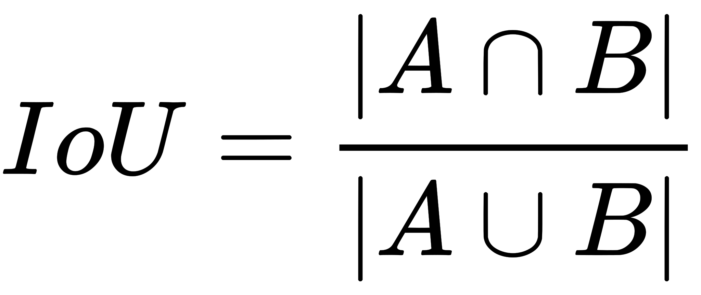
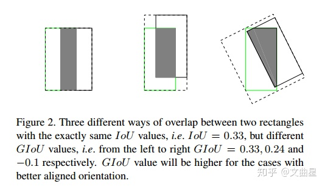
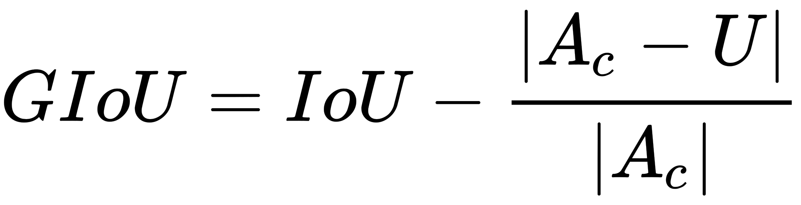
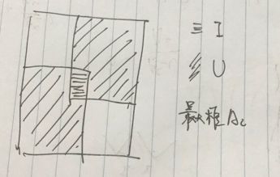
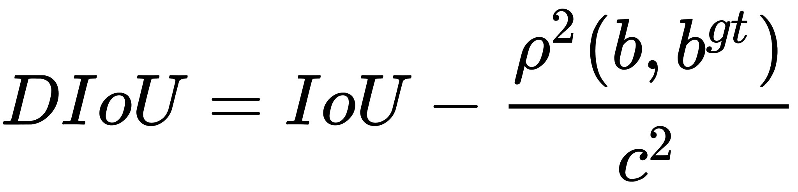
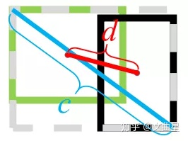
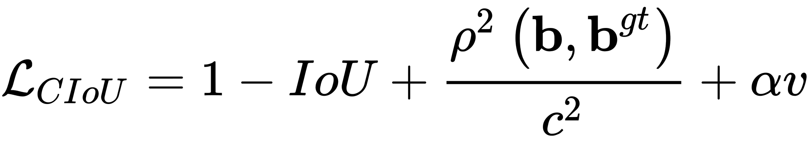
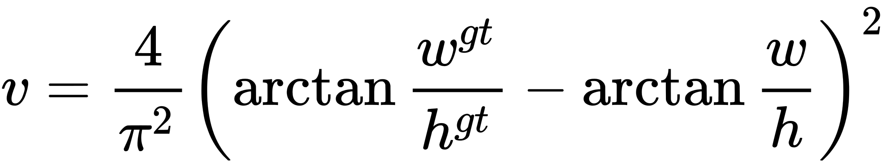

# 面试问题汇总

## 机器学习

### Bagging与Boosting的区别:
1. 取样方式（样本权重）：Bagging是均匀选取，样本的权重相等，Boosting根据错误率取样，错误率越大则权重越大。
2. 训练集的选择：Bagging随机选择训练集，训练集之间相互独立，Boosting的各轮训练集的选择与前面各轮的学习结果有关。
3. 预测函数：Bagging各个预测函数没有权重，可以并行生成，Boosting有权重，顺序生成。
4. Bagging是减少variance，Boosting是减少bias。

Bagging 是 Bootstrap Aggregating的简称，意思就是再取样 (Bootstrap) 然后在每个样本上训练出来的模型取平均，所以是降低模型的 variance. Bagging 比如 Random Forest 这种先天并行的算法都有这个效果。

Boosting 则是迭代算法，每一次迭代都根据上一次迭代的预测结果对样本进行加权，所以随着迭代不不断进行行，误差会越来越小，所以模型的 bias 会不不断降低。这种算法无法并行。


## 深度学习基础

### 手撕卷积层


### 如何计算输出的特征大小 


### pytorch 基本训练代码怎么写


## 整点CV

### IoU、GIoU、DIoU、CIoU损失函数

* IOU



反映预测检测框与真实检测框的检测效果,具有尺度不变性
初始的iou损失函数问题在于：iou为0的时候没有loss回传，无法精确反映重合度大小，如下图所示



* GIOU(Generalized Intersection over Union)



先计算两个框的最小闭包区域面积Ac (通俗理解：同时包含了预测框和真实框的最小框的面积)，再计算出IoU，再计算闭包区域中不属于两个框的区域占闭包区域的比重，最后用IoU减去这个比重得到GIoU。

GIoU不仅关注重叠区域，还关注其他的非重合区域，能更好的反映两者的重合度。



IoU取值[0,1]，但GIoU有对称区间，取值范围[-1,1]。在两者重合的时候取最大值1，在两者无交集且无限远的时候取最小值-1，因此GIoU是一个非常好的距离度量指标

与IoU只关注重叠区域不同，GIoU不仅关注重叠区域，还关注其他的非重合区域，能更好的反映两者的重合度

* DIOU(Distance-IoU)
  
DIoU要比GIou更加符合目标框回归的机制，将目标与anchor之间的距离，重叠率以及尺度都考虑进去，使得目标框回归变得更加稳定，不会像IoU和GIoU一样出现训练过程中发散等问题



b,bgt 分别代表了预测框和真实框的中心点,ρ代表的是计算两个中心点间的欧式距离。 c代表的是能够同时包含预测框和真实框的最小闭包区域的对角线距离。



优点
1. 与GIoU loss类似，DIoU loss在与目标框不重叠时，仍然可以为边界框提供移动方向。
2. DIoU loss可以直接最小化两个目标框的距离，因此比GIoU loss收敛快得多。
3. 对于包含两个框在水平方向和垂直方向上这种情况，DIoU损失可以使回归非常快，而GIoU损失几乎退化为IoU损失。
4. DIoU还可以替换普通的IoU评价策略，应用于NMS中，使得NMS得到的结果更加合理和有效。

* CIOU(Complete-IoU)
 
考虑到bbox回归三要素中的长宽比还没被考虑到计算中，因此，进一步在DIoU的基础上提出了CIoU



v度量长宽比的相似性




### nms的变体

nms目前存在的问题：
1. 将得分较低的边框强制性地去掉，如果物体出现较为密集时，本身属于两个物体的边框，其中得分较低的也有可能被抑制掉，降低了模型的召回率。
2. 速度：NMS的实现存在较多的循环步骤，GPU的并行化实现不是特别容易，尤其是预测框较多时，耗时较多。   
3. 将得分作为衡量指标。NMS简单地将得分作为一个边框的置信度，但在一些情况下，得分高的边框不一定位置更准。
4. 阈值难以确定。过高的阈值容易出现大量误检，而过低的阈值则容易降低模型的召回率，超参很难确定。


改进有Soft NMS、Softer NMS、Adaptive NMS、IoUNet

* Soft NMS
  


采用这种得分衰减方式，对于某些得分很高的边框，在后续计算中还有可能被作为正确检测框，而不像NMS那样“一棒子打死”，因此可以有效地提升模型召回率

* [Softer NMS](http://blog.prince2015.club/2018/12/01/Soft-NMS/)

假设Bounding box的是高斯分布，ground truth bounding box是狄拉克delta分布（即标准方差为0的高斯分布极限）,KL 散度用来衡量两个概率分布的非对称性度量，KL散度越接近0代表两个概率分布越相似.

具体过程与NMS大体相同，只是对预测标注方差范围内的候选框加权平均，使其更精准 简单来说 不删除框 而是融合  给个图自己体会吧，对了，输出的也比平常检测网络多四个，就是四个左边的sigma值


* Adaptive NMS 

通过网络预测目标周边的密集和稀疏的程度，采用不同的去重策略。


1. 当邻框远离M时（即IoU<Nt），保持si不变；
2. 当M处于密集区域时（即Nm>Nt），目标密度dM作为NMS的抑制阈值；
3. 当M处于稀疏区域时（即Nm≤Nt），初始阈值Nt作为NMS的抑制阈值。

* IoUNet


### mAP

例如拿到如下的结果


从头开始加入不同数量的数据都能算出对应的recall和precision  recall肯定是非递减的，那么就可以画出一个recall和precision的曲线


经过recall的插值，把折线换成直的线，计算线下面积


COCO的AP是所有类别，所有iou 0.5到0.95的平均  具体一个ap还是上述算法


### iou计算

```python
def bbox_overlaps(bboxes1, bboxes2):
    """
    Args:
        bboxes1 (Tensor): shape (m, 4)
        bboxes2 (Tensor): shape (n, 4), if is_aligned is ``True``, then m and n
            must be equal.
        mode (str): "iou" (intersection over union) or iof (intersection over
            foreground).

    Returns:
        ious(Tensor): shape (m, n) if is_aligned == False else shape (m, 1)
    """

    rows = bboxes1.size(0)
    cols = bboxes2.size(0)
   
    if rows * cols == 0:
        return bboxes1.new(rows, cols)
    lt = torch.max(bboxes1[:, None, :2], bboxes2[:, :2])  # [rows, cols, 2]
    rb = torch.min(bboxes1[:, None, 2:], bboxes2[:, 2:])  # [rows, cols, 2]

    wh = (rb - lt + 1).clamp(min=0)  # [rows, cols, 2]
    overlap = wh[:, :, 0] * wh[:, :, 1]
    area1 = (bboxes1[:, 2] - bboxes1[:, 0] + 1) * (
        bboxes1[:, 3] - bboxes1[:, 1] + 1)


    area2 = (bboxes2[:, 2] - bboxes2[:, 0] + 1) * (
        bboxes2[:, 3] - bboxes2[:, 1] + 1)
    ious = overlap / (area1[:, None] + area2 - overlap)

    return ious
```


