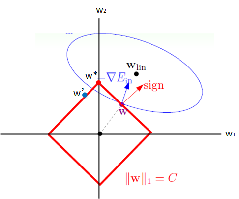
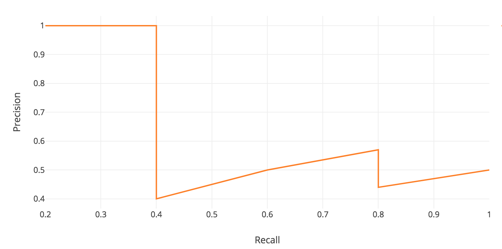

[TOC]

# 面试问题汇总

## 机器学习

### 梯度下降法

对每一个参数求偏导，乘上步长进行优化

变体：

1. BGD批量梯度下降法：更新参数的时候使用所有的样本进行更新
2. SGD随机梯度下降法：只使用随机一个样本进行梯度下降，和BGD的对比是，速度快，但是下降不稳定
3. Mini-batch Gradient Descent小批量梯度下降法：折衷一下1，2

与其他优化方法比较：
相较于最小二乘法，后者需要解析解，计算更慢
和牛顿法/拟牛顿法相比，两者都是迭代求解，不过梯度下降法是梯度求解，而牛顿法/拟牛顿法是用二阶的海森矩阵的逆矩阵或伪逆矩阵求解。相对而言，使用牛顿法/拟牛顿法收敛更快。但是每次迭代的时间比梯度下降法长。


### 牛顿法 拟牛顿法

牛顿法（Newton method）和拟牛顿法(quasi-Newton method)也是求解无约束最优化问题的常用方法，有收敛速度快的优点。牛顿法是迭代算法，每一步需要求解目标函数的黑塞矩阵的逆矩阵，计算比较复杂。拟牛顿法通过正定矩阵近似黑塞矩阵

* 对于牛顿法：

对原函数进行泰勒展开为：


对这个函数求一阶导，让其等于0，得到x的迭代关系


*  拟牛顿法：

在牛顿法的迭代中，需要计算黑塞矩阵的逆矩阵H^-1，这一计算比较复杂，考虑用一个n阶矩阵G= Gk来近似代替H^-1。这就是拟牛顿法的基本想法

有牛顿法的一阶导的表达式代入xk-1 可得


得到拟牛顿法的条件

拟牛顿法在迭代过程中更新矩阵G 根据不同的实现方法 又分为更多的拟牛顿法

### 样本不平衡问题

算法层面：svm，决策树，对于类别不平衡表现较好

数据层面：采样

loss层面： focal loss


### 过拟合

1. 获取更多数据，数据增强，GAN
2. 减少网络参数，不要训练过长时间
3. 正则化 bn，weight decay，dropout
4. 加噪声
5. 多模型bagging boosting
6. label smoothing， 自学习，mixup等新的方法

### 生成模型 vs 判别模型

生成模型：学习得到联合概率分布P(x,y)，即特征x和标记y共同出现的概率，然后求条件概率分布。能够学习到数据生成的机制

* 生成模型：朴素贝叶斯方法，隐马尔可夫模型
* 判别模型：k近邻法，感知机，决策树，逻辑斯蒂回归模型，最大熵模型，svm，提升方法，条件随机场

* 优点
  
1. 可以得到分布的更多信息
2. 收敛速度快，数据较多时，更快的收敛于真实模型
3. 能够应付隐变量存在的情况

* 缺点
  
1. 效果没有判别式好
2. 需要更多计算和数据

判别模型：习得到条件概率分布P(y|x)，即在特征x出现的情况下标记y出现的概率

* 优点

1. 节省计算，训练集需要相对较少
2. 准确率高
3. 允许对对输入进行降维，构造，简化问题

* 缺点

1. 生成模型的好处没得 

### 决策树是怎么样进行划分的，决策树的损失函数

* ID3: 信息增益  H(D)-H(D|A)

* C4.5：信息增益比 (H(D)-H(D|A))/H_A(D) ,  H_A(D)就是D数据在A的分类下的熵

* CART：
  1. 回归树：平方误差最小
  2. 基尼系数最小 Gini(p) = Σ_k p_k (1-p_k) = 1 - Σ_k (p_k)^2。 
     
     在特征值为A的情况下，Gini(D,A)= |D1|/|D|\*(Gini(D1)) + |D2|/|D|\*(Gini(D2))

### 随机森林


### 推导朴素贝叶斯公式


### l1,l2正则化

正则化（Regularization）是机器学习中一种常用的技术，其主要目的是控制模型复杂度，减小过拟合

解释一下范数

0范数：向量中非零元素的个数（即为其稀疏度）

1范数：绝对值之和

2范数：向量元素绝对值的平方和再开方

最基础的理解：

1. l1正则化等价于在原优化目标函数中增加约束条件||w||<C
2. l2正则化等价于在原优化目标函数中增加约束条件||w||^2<C

从最大后验概率分析（见最大后验概率字条）：

1. l1正则化可通过假设权重w的先验分布为拉普拉斯分布，由最大后验概率估计导出；
2. l2正则化可通过假设权重w的先验分布为高斯分布，由最大后验概率估计导出。

效果来说：

1. l1正则化则会使原最优解的元素产生不同量的偏移，并使某些元素为0，从而产生稀疏性。
2. l2正则化的效果是对原最优解的每个元素进行不同比例的放缩

l1产生稀疏性理解：



红框为l1正则约束，蓝色是优化函数的等高线，蓝色是梯度方向，但是由于正则约束只能向w2方向移动，造成了w1的抑制，所以产生了稀疏性。

因为 L1 天然的输出稀疏性，把不重要的特征都置为 0，所以它也是一个天然的特征选择器。

但是L2计算起来更方便，而 L1在特别是非稀疏向量上的计算效率就很低；

[更详细解释看这里](https://zhuanlan.zhihu.com/p/29360425)

### 最大似然函数 最大后验概率  区别

极大似然实际上对应的是频率学派，最大后验概率对应的是贝叶斯学派

极大似然函数对应的是经验风险最小化，最大后验概率对应的是结构风险最小化

关系如下


### SVM

SVM的构造,SVM的损失函数:


    
SVM的核函数:

核函数：K(x,z) = Φ(x)*Φ(z)

核技巧为只定义K，而不显示的定义映射函数，同一核函数的映射不唯一

常用核函数：多项式核函数，高斯核函数，字符串核函数

### sigmoid softmax lr 
都跟exp()有关系

sigmoid：


softmax：


lr见本页

### LR
二项逻辑斯蒂回归：


loss，即目标函数为


多项逻辑斯蒂回归：


### Bagging与Boosting的区别:
1. 取样方式（样本权重）：Bagging是均匀选取，样本的权重相等，Boosting根据错误率取样，错误率越大则权重越大。
2. 训练集的选择：Bagging随机选择训练集，训练集之间相互独立，Boosting的各轮训练集的选择与前面各轮的学习结果有关。
3. 预测函数：Bagging各个预测函数没有权重，可以并行生成，Boosting有权重，顺序生成。
4. Bagging是减少variance，Boosting是减少bias。

Bagging 是 Bootstrap Aggregating的简称，意思就是再取样 (Bootstrap) 然后在每个样本上训练出来的模型取平均，所以是降低模型的 variance. Bagging 比如 Random Forest 这种先天并行的算法都有这个效果。

Boosting 则是迭代算法，每一次迭代都根据上一次迭代的预测结果对样本进行加权，所以随着迭代不不断进行行，误差会越来越小，所以模型的 bias 会不不断降低。这种算法无法并行。

### AUC的意义

AUC即ROC曲线下的面积

ROC曲线的横轴是FP，纵轴是TP,如果二者相同，表示的意义是：对于不论真实类别是1还是0的样本，分类器预测为1的概率是相等的。如下图，换句话说，分类器对于正例和负例毫无区分能力，和抛硬币没什么区别


理想的情况是TP比FP要准，甚至TP一直是1。

整个例子：
1.硬分类器

| |||||||||
|:----|:----:|:----:|:----:|:----:|:----:|:----:|:----:|:----:|
|真实 |1|1| 1|1|0|0|0| 0| 
|预测 |1| 0| 1|1| 0|1| 1| 0|

那么整理一下：


进而算得TPRate=3/4，FPRate=2/4，得到ROC曲线：


对于带有置信度的分类

| |||||||||
|:----|:----:|:----:|:----:|:----:|:----:|:----:|:----:|:----:|
|真实 |1|1| 1|1|0|0|0| 0| 
|预测 |0.8|0.3|0.9|0.6|0.1|0.5|0.7|0.2|

这时，需要设置阈值来得到混淆矩阵，依次使用所有预测值作为阈值，得到一系列TPRate，FPRate，描点，求面积，即可得到AUC。

**AUC的优势，AUC的计算方法同时考虑了分类器对于正例和负例的分类能力，在样本不平衡的情况下，依然能够对分类器作出合理的评价**

## 深度学习基础

### 手撕卷积层

```python
## CNN 前传

def conv_forward_naive(x, w, b, conv_param):
    N, C, H, W = x.shape
    F, C, HH, WW = w.shape
    pad, stride = conv_param["pad"], conv_param["stride"]
    X = np.pad(x, ((0, 0), (0, 0), (pad, pad), (pad, pad)), "constant")
    
    H_out = 1 + int((H + 2 * pad - HH) / stride)
    W_out = 1 + int((W + 2 * pad - WW) / stride)
    out = np.zeros((N, F, H_out, W_out))
    
    for n in range(N):
        for f in range(F):
            for i in range(H_out):
                for j in range(W_out):
                    data = X[n, :, i * stride: i * stride + HH, j * stride: j * stride + WW].reshape(1, -1)
                    filt = w[f, :, :, :].reshape(-1, 1)
                    out[n, f, i, j] = data.dot(filt) + b[f]
                    
    cache = (x, w, b, conv_param)
    return out, cache

## CNN后传

def conv_backward_naive(dout, cache):
    x, w, b, conv_param = cache
    N, F, H_out, W_out = dout.shape
    N, C, H, W = x.shape
    F, C, HH, WW = w.shape
    pad, stride = conv_param["pad"], conv_param["stride"]
    X = np.pad(x, ((0, 0), (0, 0), (pad, pad), (pad, pad)), "constant")
    dw = np.zeros_like(w)
    dX = np.zeros_like(X)
    
    for n in range(N):
        for f in range(F):
            for i in range(H_out):
                for j in range(W_out):
                    dX[n, :, i * stride: i * stride + HH, j * stride: j * stride + WW] += w[f] * dout[n, f, i, j]
                    dw[f] += X[n, :, i * stride: i * stride + HH, j * stride: j * stride + WW] * dout[n, f, i, j]
                    
    db = np.sum(dout, axis=(0, 2, 3))
    dx = dX[:, :, pad: -pad, pad: -pad]
    return dx, dw, db
```

### pytorch 基本训练代码怎么写

### batchnorm


### dropout

### some backbones

### faster RCNN 偏移

```matlab
Ground Truth: gx, gy, gw, gh
Anchor:       ax, ay, aw, ah

tx = (gx-ax)/aw

ty = (gy-ay)/ah

tw = log(gw/aw)

th = log(gh/ah)
```

预测 px,py,pw,ph以接近 tx, ty, tw, th


### 梯度爆炸
本质上是因为梯度反向传播中的连乘效应

对激活函数进行求导，如果此部分大于1，那么层数增多的时候，最终的求出的梯度更新将以指数形式增加，即发生**梯度爆炸**，如果此部分小于1，那么随着层数增多，求出的梯度更新信息将会以指数形式衰减，即发生了**梯度消失**。

解决方案：
1. 预训练加微调
2. 梯度剪切：对梯度设定阈值：如果梯度超过这个阈值，那么就将其强制限制在这个范围之内。这可以防止**梯度爆炸**
3. 权重正则化：比较常见的是 L1 正则和 L2 正则
4. 选择relu等梯度大部分落在常数上的激活函数
5. batch normalization
6. 残差网络的捷径（shortcut） 解决的是**梯度消失**
7. LSTM的“门（gate）”结构

### 1*1 卷积核作用
1. 降维 升维
2. 增加非线性
3. 跨通道信息交互

### activation function


1. sigmoid:
* *可以解释，比如将0-1之间的取值解释成一个神经元的激活率*
* 有饱和区域，是软饱和，在大的正数和负数作为输入的时候，梯度就会变成零，使得神经元基本不能更新
* 只有正数输出（不是zero-centered），这就导致所谓的zigzag现象
* 计算量大（exp）

2. tanh
* *zero-centered*
* 还是会饱和

3. ReLU
* *CNN中常用*
* *更省计算量，收敛较快*
* relu在负数区域被kill的现象叫做dead relu

4. LeakyReLU
* *让负数区域不在饱和死掉*

5. ELU
* *具有relu的优势，且输出均值接近零*
* *有负数饱和区域，从而对噪声有一些鲁棒性*
* 也需要计算exp，从而计算量上更大一些。


## 整点CV

### IoU、GIoU、DIoU、CIoU损失函数

* IOU


反映预测检测框与真实检测框的检测效果,具有尺度不变性
初始的iou损失函数问题在于：iou为0的时候没有loss回传，无法精确反映重合度大小，如下图所示


* GIOU(Generalized Intersection over Union)


先计算两个框的最小闭包区域面积Ac (通俗理解：同时包含了预测框和真实框的最小框的面积)，再计算出IoU，再计算闭包区域中不属于两个框的区域占闭包区域的比重，最后用IoU减去这个比重得到GIoU。

GIoU不仅关注重叠区域，还关注其他的非重合区域，能更好的反映两者的重合度。


IoU取值[0,1]，但GIoU有对称区间，取值范围[-1,1]。在两者重合的时候取最大值1，在两者无交集且无限远的时候取最小值-1，因此GIoU是一个非常好的距离度量指标

与IoU只关注重叠区域不同，GIoU不仅关注重叠区域，还关注其他的非重合区域，能更好的反映两者的重合度

* DIOU(Distance-IoU)
  
DIoU要比GIou更加符合目标框回归的机制，将目标与anchor之间的距离，重叠率以及尺度都考虑进去，使得目标框回归变得更加稳定，不会像IoU和GIoU一样出现训练过程中发散等问题


b,bgt 分别代表了预测框和真实框的中心点,ρ代表的是计算两个中心点间的欧式距离。 c代表的是能够同时包含预测框和真实框的最小闭包区域的对角线距离。


优点
1. 与GIoU loss类似，DIoU loss在与目标框不重叠时，仍然可以为边界框提供移动方向。
2. DIoU loss可以直接最小化两个目标框的距离，因此比GIoU loss收敛快得多。
3. 对于包含两个框在水平方向和垂直方向上这种情况，DIoU损失可以使回归非常快，而GIoU损失几乎退化为IoU损失。
4. DIoU还可以替换普通的IoU评价策略，应用于NMS中，使得NMS得到的结果更加合理和有效。

* CIOU(Complete-IoU)
 
考虑到bbox回归三要素中的长宽比还没被考虑到计算中，因此，进一步在DIoU的基础上提出了CIoU


v度量长宽比的相似性


### nms的变体

nms目前存在的问题：
1. 将得分较低的边框强制性地去掉，如果物体出现较为密集时，本身属于两个物体的边框，其中得分较低的也有可能被抑制掉，降低了模型的召回率。
2. 速度：NMS的实现存在较多的循环步骤，GPU的并行化实现不是特别容易，尤其是预测框较多时，耗时较多。   
3. 将得分作为衡量指标。NMS简单地将得分作为一个边框的置信度，但在一些情况下，得分高的边框不一定位置更准。
4. 阈值难以确定。过高的阈值容易出现大量误检，而过低的阈值则容易降低模型的召回率，超参很难确定。


改进有Soft NMS、Softer NMS、Adaptive NMS、IoUNet

* Soft NMS
  


采用这种得分衰减方式，对于某些得分很高的边框，在后续计算中还有可能被作为正确检测框，而不像NMS那样“一棒子打死”，因此可以有效地提升模型召回率

* [Softer NMS](http://blog.prince2015.club/2018/12/01/Soft-NMS/)

假设Bounding box的是高斯分布，ground truth bounding box是狄拉克delta分布（即标准方差为0的高斯分布极限）,KL 散度用来衡量两个概率分布的非对称性度量，KL散度越接近0代表两个概率分布越相似.

具体过程与NMS大体相同，只是对预测标注方差范围内的候选框加权平均，使其更精准 简单来说 不删除框 而是融合  给个图自己体会吧，对了，输出的也比平常检测网络多四个，就是四个左边的sigma值


* Adaptive NMS 

通过网络预测目标周边的密集和稀疏的程度，采用不同的去重策略。


1. 当邻框远离M时（即IoU<Nt），保持si不变；
2. 当M处于密集区域时（即Nm>Nt），目标密度dM作为NMS的抑制阈值；
3. 当M处于稀疏区域时（即Nm≤Nt），初始阈值Nt作为NMS的抑制阈值。

* IoUNet


### mAP

例如拿到如下的结果


从头开始加入不同数量的数据都能算出对应的recall和precision  recall肯定是非递减的，那么就可以画出一个recall和precision的曲线



经过recall的插值，把折线换成直的线，计算线下面积


COCO的AP是所有类别，所有iou 0.5到0.95的平均  具体一个ap还是上述算法

### roi align & roi pooling

roi pooling的两次取整：

1. 原图中有一region proposal，大小为665\*665，这样映射到特征图中的大小：665/32=20.78,即20.78\*20.78，如果你看过Caffe的Roi Pooling的C++源码，在计算的时候会进行取整操作，于是，进行所谓的第一次量化，即映射的特征图大小为20\*20
2. pooling后固定成7\*7大小的特征图，所以，将上面在 feature map上映射的20\*20的 region  proposal划分成49个同等大小的小区域，每个小区域的大小20/7=2.86,即2.86\*2.86，此时，进行第二次量化，故小区域大小变成2\*2 


roi align的保留小数：

1. 原图中有一region proposal，大小为665\*665，这样，映射到特征图中的大小：665/32=20.78,即20.78\*20.78，此时，没有像RoiPooling那样就行取整操作，保留浮点数
2. pooling后固定成7\*7大小的特征图，所以，将在 feature map上映射的20.78\*20.78的region proposal 划分成49个同等大小的小区域，每个小区域的大小20.78/7=2.97,即2.97\*2.97
3. 假定采样点数为4，即表示，对于每个2.97*2.97的小区域，平分四份，每一份取其中心点位置，而中心点位置的像素，采用双线性插值法进行计算，这样，就会得到四个点的像素值，如下图


上图中，四个红色叉叉的像素值是通过双线性插值算法计算得到的

最后，取四个像素值中最大值作为这个小区域(即：2.97\*2.97大小的区域)的像素值，如此类推，同样是49个小区域得到49个像素值，组成7\*7大小的feature map

### focal loss


相对于直接对CE加参数能够通过减少易分类样本的权重，从而使得模型在训练时更专注于难分类的样本。

两方面作用：

1. 调制系数就趋于1，也就是说相比原来的loss是没有什么大的改变的。当pt趋于1的时候（此时分类正确而且是易分类样本），调制系数趋于0，也就是对于总的loss的贡献很小 
2. 当γ=0的时候，focal loss就是传统的交叉熵损失，当γ增加的时候，调制系数也会增加。 专注参数γ平滑地调节了易分样本调低权值的比例。γ增大能增强调制因子的影响


### iou计算

```python
def bbox_overlaps(bboxes1, bboxes2):
    """
    Args:
        bboxes1 (Tensor): shape (m, 4)
        bboxes2 (Tensor): shape (n, 4), if is_aligned is ``True``, then m and n
            must be equal.
        mode (str): "iou" (intersection over union) or iof (intersection over
            foreground).

    Returns:
        ious(Tensor): shape (m, n) if is_aligned == False else shape (m, 1)
    """

    rows = bboxes1.size(0)
    cols = bboxes2.size(0)
   
    if rows * cols == 0:
        return bboxes1.new(rows, cols)
    lt = torch.max(bboxes1[:, None, :2], bboxes2[:, :2])  # [rows, cols, 2]
    rb = torch.min(bboxes1[:, None, 2:], bboxes2[:, 2:])  # [rows, cols, 2]

    wh = (rb - lt + 1).clamp(min=0)  # [rows, cols, 2]
    overlap = wh[:, :, 0] * wh[:, :, 1]
    area1 = (bboxes1[:, 2] - bboxes1[:, 0] + 1) * (
        bboxes1[:, 3] - bboxes1[:, 1] + 1)


    area2 = (bboxes2[:, 2] - bboxes2[:, 0] + 1) * (
        bboxes2[:, 3] - bboxes2[:, 1] + 1)
    ious = overlap / (area1[:, None] + area2 - overlap)

    return ious
```


